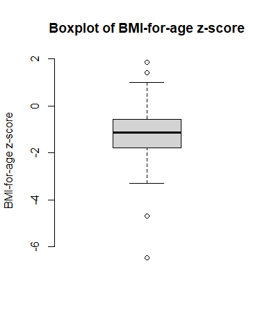
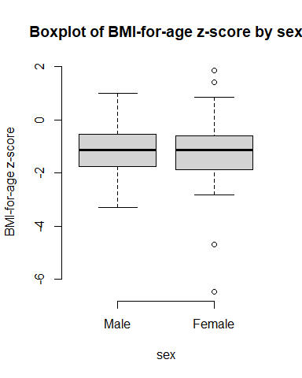
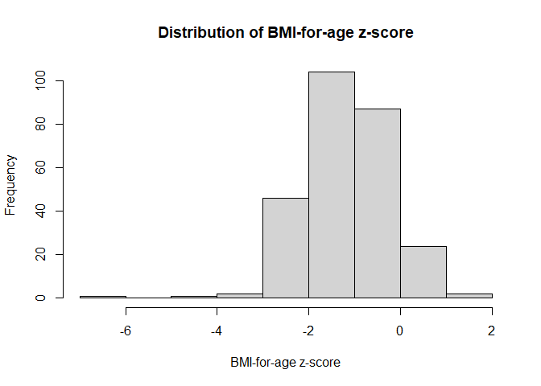
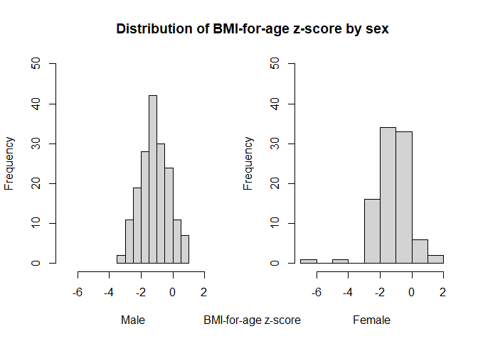

<!-- README.md is generated from README.Rmd. Please edit that file -->

# Return of the BMI (Data processing and statistical analysis in R)

<!-- badges: start -->
<!-- badges: end -->

This repository is an exercise in processing data and performing
statistical analysis in **R** using a dataset from a Pakistan school
nutrition survey of students older than 10 years old.

By this time, you should already know how to clone this repository into
your local machine using RStudio. If you need a refresher, the following
tutorial shows the steps on how to do this -
<https://oxford-ihtm.io/ihtm-handbook/clone-repository.html>.

## Instructions for the assignment

The following tasks have been designed to help students get familiar
with processing of data and performing statistical analysis in R.

The students are expected to go through the tasks and appropriately
write R code/script to fulfil the tasks and/or to answer the question/s
being asked within the tasks. R code/script should be written inside a
single R file named `return_of_the_bmi.R` and saved in the project’s
root directory.

## Task 1: Honey, I lost the data!

For some reason, the data `school_nutrition.csv` has been lost and is
not found within the `data` folder within the project directory.

Thankfully, this data is available via Oxford IHTM’s GitHub repository
called `teaching_datasets` found at
<https://github.com/OxfordIHTM/teaching_datasets>. In this repository,
there are two files in different formats that both contain the dataset
we need for this exercise. There is the CSV file called
`school_nutrition.csv` which is the exact same dataset that you had in
the previous exercise and there is also the XLSX file called
`school_nutrition.xlsx` which is the exact same dataset but as an Excel
file.

For this task, you should look into ways to get back the school
nutrition data and read it into R as we did previously.

1.  Looking deeper into the `read.table()` function (`?read.table`), is
    there a way to read a CSV file directly from a URL or web link? If
    so, write code that does this.

**Here is the code that will read the data from a URL:**

``` r
nut_data <- read.csv(file = "https://raw.githubusercontent.com/OxfordIHTM/teaching_datasets/main/school_nutrition.csv")
```

The school nutrition dataset contained in the `nut_data` object has
**267** records and **6** variables. The `nut_data` object looks like
this (showing first 10 records in the data):

| region | school | age_months | sex | weight | height |
|-------:|-------:|-----------:|----:|-------:|-------:|
|      1 |      1 |        121 |   2 |   20.6 |  124.6 |
|      1 |      1 |        121 |   1 |   27.9 |  130.7 |
|      1 |      1 |        129 |   2 |   25.7 |  131.4 |
|      1 |      1 |        133 |   1 |   27.0 |  135.7 |
|      1 |      1 |        145 |   2 |   28.5 |  130.5 |
|      1 |      1 |        148 |   2 |   35.1 |  142.1 |
|      1 |      1 |        148 |   2 |   23.8 |  125.8 |
|      1 |      1 |        148 |   2 |   34.1 |  144.9 |
|      1 |      1 |        149 |   2 |   29.4 |  143.5 |
|      1 |      1 |        149 |   2 |   34.5 |  141.5 |

2.  You may want to be able to download the dataset and save it back
    into the `data` directory. The function `download.file()`
    (`?download.file`) can be used for this purpose. Write code that
    would download the CSV file into the `data` directory of the project
    and then read the CSV file from the `data` directory into R.

**Here is code that will download data from URL into the `data`
folder:**

``` r
download.file(
  url = "https://raw.githubusercontent.com/OxfordIHTM/teaching_datasets/main/school_nutrition.csv",
  destfile = "data/schoo_nutrition.csv"
)
```

**And here is code that will read that file from the `data` folder:**

``` r
nut_data <- read.csv(file = "data/school_nutrition.csv")
```

This approach gives the same result as the earlier approach as shown
below (showing first 10 records only):

| region | school | age_months | sex | weight | height |
|-------:|-------:|-----------:|----:|-------:|-------:|
|      1 |      1 |        121 |   2 |   20.6 |  124.6 |
|      1 |      1 |        121 |   1 |   27.9 |  130.7 |
|      1 |      1 |        129 |   2 |   25.7 |  131.4 |
|      1 |      1 |        133 |   1 |   27.0 |  135.7 |
|      1 |      1 |        145 |   2 |   28.5 |  130.5 |
|      1 |      1 |        148 |   2 |   35.1 |  142.1 |
|      1 |      1 |        148 |   2 |   23.8 |  125.8 |
|      1 |      1 |        148 |   2 |   34.1 |  144.9 |
|      1 |      1 |        149 |   2 |   29.4 |  143.5 |
|      1 |      1 |        149 |   2 |   34.5 |  141.5 |

3.  It would be good to learn how to read data from an XLSX file as it
    will not be uncommon these days to have data in XLSX format. For
    this purpose, the `openxlsx` package will be useful, specifically
    its `read.xlsx()` function. Install `openxlsx` (if you haven’t done
    so already), load it into your environment (`library(openxlsx)`),
    and then read up on the `read.xlsx()` function (`?read.xlsx`) to
    figure out how to read the `student_nutrition.xlsx` file via URL
    using the `read.xlsx()` function. Write code that shows these steps.

**Here is code that will read the XLSX file for the school nutrition
data into R:**

``` r
nut_data <- read.xlsx(
  xlsxFile = "https://raw.githubusercontent.com/OxfordIHTM/teaching_datasets/main/school_nutrition.xlsx",
  sheet = 1
)
```

We expect that the data in the `XLSX` file is the same as the data in
the CSV file. We confirm this as shown below (showing first 10 records
only):

| region | school | age_months | sex | weight | height |
|-------:|-------:|-----------:|----:|-------:|-------:|
|      1 |      1 |        121 |   2 |   20.6 |  124.6 |
|      1 |      1 |        121 |   1 |   27.9 |  130.7 |
|      1 |      1 |        129 |   2 |   25.7 |  131.4 |
|      1 |      1 |        133 |   1 |   27.0 |  135.7 |
|      1 |      1 |        145 |   2 |   28.5 |  130.5 |
|      1 |      1 |        148 |   2 |   35.1 |  142.1 |
|      1 |      1 |        148 |   2 |   23.8 |  125.8 |
|      1 |      1 |        148 |   2 |   34.1 |  144.9 |
|      1 |      1 |        149 |   2 |   29.4 |  143.5 |
|      1 |      1 |        149 |   2 |   34.5 |  141.5 |

## Task 2: Calculate BMI

Now that you have the school nutrition data into your R environment,
write code that would calculate the BMI for each student in the dataset
and then add this value as a new variable called `bmi` in the student
nutrition dataset object.

To make this more challenging, please write a function that will
specifically make this calculation of BMI. You have done this already
earlier so make sure you pick up on feedback provided earlier to improve
the function you have written.

**Here is a function that will calculate BMI given weight and height:**

``` r
calculate_bmi <- function(weight, height) {
  weight / height ^ 2
}
```

**We can now use this function to calculate BMI of the children in the
school nutrition dataset:**

``` r
nut_data$bmi <- calculate_bmi(nut_data$weight, nut_data$height / 100)
```

**The values of the BMI for each child is now included as a variable in
the `nut_data` object:**

``` r
## Check the names of variables in `nut_data`
names(nut_data)
#> [1] "region"     "school"     "age_months" "sex"        "weight"    
#> [6] "height"     "bmi"
```

| region | school | age_months | sex | weight | height |      bmi |
|-------:|-------:|-----------:|----:|-------:|-------:|---------:|
|      1 |      1 |        121 |   2 |   20.6 |  124.6 | 13.26878 |
|      1 |      1 |        121 |   1 |   27.9 |  130.7 | 16.33251 |
|      1 |      1 |        129 |   2 |   25.7 |  131.4 | 14.88478 |
|      1 |      1 |        133 |   1 |   27.0 |  135.7 | 14.66237 |
|      1 |      1 |        145 |   2 |   28.5 |  130.5 | 16.73493 |
|      1 |      1 |        148 |   2 |   35.1 |  142.1 | 17.38277 |
|      1 |      1 |        148 |   2 |   23.8 |  125.8 | 15.03889 |
|      1 |      1 |        148 |   2 |   34.1 |  144.9 | 16.24118 |
|      1 |      1 |        149 |   2 |   29.4 |  143.5 | 14.27722 |
|      1 |      1 |        149 |   2 |   34.5 |  141.5 | 17.23083 |

## Task 3: Calculating age-standardised BMI

Unlike adults, BMI for children need to be age-standardised. For this,
calculation of z-scores is the statistical approach used.

Read up on z-scores and how they are calculated. Then try to find an R
package that has function/s that will calculate z-scores for BMI that
adjusts for sex and age. Once you have found such package, learn how to
use the specific function/s and then implement this in your code by
calculating the BMI-for-age z-score for each student and then add this
value as a new variable called `bfaz` in the student nutrition dataset
object.

Once you have calculated `bfaz`, create an R function that will classify
the BMI status of each student based on their BMI-for-age z-score.
Following are the cut-offs for BMI-for-age z-score based on the WHO
Growth Standards:

| BMI-for-age z-score range              | Classification |
|:---------------------------------------|:---------------|
| BMI-for-age z-score \> 2 SD            | Obese          |
| 2 SD \>= BMI-for-age z-score \> 1 SD   | Overweight     |
| 1 SD \>= BMI-for-age z-score \>= -2 SD | Normal         |
| -2 SD \> BMI-for-age z-score \>= -3 SD | Thin           |
| BMI-for-age z-score \< -3 SD           | Severely thin  |

We calculated the **BMI-for-age zscore** using the
[`zscorer`](https://nutriverse.io/zscorer) package. Specifically, we
used the `addWGSR()` function as follows:

``` r
## Convert age in months to age in days ----
nut_data$age_days <- nut_data$age_months * (365.25 / 12)

nut_data <- addWGSR(
  data = nut_data, 
  sex = "sex", 
  firstPart = "weight", 
  secondPart = "height", 
  thirdPart = "age_days",
  index = "bfa"
)
#> ================================================================================
```

This creates a new variable in `nut_data` called `bfaz` as shown below
(showing first 10 records only):

| region | school | age_months | sex | weight | height |      bmi | age_days |  bfaz |
|-------:|-------:|-----------:|----:|-------:|-------:|---------:|---------:|------:|
|      1 |      1 |        121 |   2 |   20.6 |  124.6 | 13.26878 | 3682.938 | -2.19 |
|      1 |      1 |        121 |   1 |   27.9 |  130.7 | 16.33251 | 3682.938 | -0.09 |
|      1 |      1 |        129 |   2 |   25.7 |  131.4 | 14.88478 | 3926.438 | -1.20 |
|      1 |      1 |        133 |   1 |   27.0 |  135.7 | 14.66237 | 4048.188 | -1.51 |
|      1 |      1 |        145 |   2 |   28.5 |  130.5 | 16.73493 | 4413.438 | -0.61 |
|      1 |      1 |        148 |   2 |   35.1 |  142.1 | 17.38277 | 4504.750 | -0.39 |
|      1 |      1 |        148 |   2 |   23.8 |  125.8 | 15.03889 | 4504.750 | -1.68 |
|      1 |      1 |        148 |   2 |   34.1 |  144.9 | 16.24118 | 4504.750 | -0.96 |
|      1 |      1 |        149 |   2 |   29.4 |  143.5 | 14.27722 | 4535.188 | -2.25 |
|      1 |      1 |        149 |   2 |   34.5 |  141.5 | 17.23083 | 4535.188 | -0.49 |

The following function can classify the school children’s BMI-for-age
z-scores to their corresponding nutrition status as indicated in the
table above:

``` r
classify_bmi_children <- function(bmiz) {
  ifelse(
    bmiz > 2, "obese",
    ifelse(
      bmiz <= 2 & bmiz > 1, "overweight",
      ifelse(
        bmiz <= 1 & bmiz >= -2, "normal",
        ifelse(
          bmiz >= -3 & bmiz < -2, "thin", "severely thin"
        )
      )
    )
  )
}
```

Applying this function on the school nutrition dataset

``` r
nut_data$bmi_classification <- classify_bmi_children(nut_data$bfaz)
```

we get the following results (showing first 10 rows):

``` r
nut_data[1:10, ] %>%
  knitr::kable()
```

| region | school | age_months | sex | weight | height |      bmi | age_days |  bfaz | bmi_classification |
|-------:|-------:|-----------:|----:|-------:|-------:|---------:|---------:|------:|:-------------------|
|      1 |      1 |        121 |   2 |   20.6 |  124.6 | 13.26878 | 3682.938 | -2.19 | thin               |
|      1 |      1 |        121 |   1 |   27.9 |  130.7 | 16.33251 | 3682.938 | -0.09 | normal             |
|      1 |      1 |        129 |   2 |   25.7 |  131.4 | 14.88478 | 3926.438 | -1.20 | normal             |
|      1 |      1 |        133 |   1 |   27.0 |  135.7 | 14.66237 | 4048.188 | -1.51 | normal             |
|      1 |      1 |        145 |   2 |   28.5 |  130.5 | 16.73493 | 4413.438 | -0.61 | normal             |
|      1 |      1 |        148 |   2 |   35.1 |  142.1 | 17.38277 | 4504.750 | -0.39 | normal             |
|      1 |      1 |        148 |   2 |   23.8 |  125.8 | 15.03889 | 4504.750 | -1.68 | normal             |
|      1 |      1 |        148 |   2 |   34.1 |  144.9 | 16.24118 | 4504.750 | -0.96 | normal             |
|      1 |      1 |        149 |   2 |   29.4 |  143.5 | 14.27722 | 4535.188 | -2.25 | thin               |
|      1 |      1 |        149 |   2 |   34.5 |  141.5 | 17.23083 | 4535.188 | -0.49 | normal             |

## Task 4: Show and test the normality of the distribution of the BMI-for-age z-score variable

Write code that tests the normality of the BMI variable and answer the
following questions:

- Is the BMI-for-age z-score of all students in the sample normally
  distributed?

- Is the BMI-for-age z-score of all the male students in the sample
  normally distributed?

- Is the BMI-for-age z-score of all the female students in the sample
  normally distributed?

Please write a script that shows normality **graphically** and through
**formal statistical test/s**.

``` r
boxplot(nut_data$bfaz,
        ylab = "BMI-for-age z-score",                ## Add y-axis label
        main = "Boxplot of BMI-for-age z-score",     ## add a title to plot
        frame.plot = FALSE)
```



``` r
boxplot(bfaz ~ sex,                       ## use formula method
        data = nut_data,
        names = c("Male", "Female"),      ## Name each boxplot instead of 1 and 2
        ylab = "BMI-for-age z-score",
        main = "Boxplot of BMI-for-age z-score by sex",
        frame.plot = FALSE)
```



``` r
##### Histogram of BMI-for-age z-score for all students ----
hist(nut_data$bfaz,
     xlab = "BMI-for-age z-score",
     main = "Distribution of BMI-for-age z-score")
```



``` r
##### Histogram of BMI-for-age z-score by sex ----
par(mfrow = c(1, 2))        ## Create 2 plotting regions side-by-side

with(
  nut_data,
  {
    hist(bfaz[sex == 1],    ## bfaz for males
         xlim = c(-7, 2),   ## expand limits of x-axis
         ylim = c(0, 50),   ## set limits of y-axis
         xlab = "Male",     ## set x-axis label to Male
         main = "")         ## remove plot title for males
    hist(bfaz[sex == 2],    ## bfaz for females
         xlim = c(-7, 2),   ## expand limits of x-axis
         ylim = c(0, 50),   ## set limits of y-axis
         xlab = "Female",   ## set x-axis label to Female
         main = "")         ## remove plot title for females
  }
)

par(mfrow = c(1, 1))        ## return graphical window back to one plot region
title(
  main = "Distribution of BMI-for-age z-score by sex",
  xlab = "BMI-for-age z-score"
)
```



## Task 5: Summarising BMI data

Write code that summarises the data as follows:

- Mean value of BMI-for-age z-score for male and female students and
  overall;

- Number and proportion of children who are undernourished based on
  BMI-for-age z-score (at least thin);

- Number and proportion of children who are over-nourished based on
  BMI-for-age z-score (at least overweight).

Please show your results as rectangular data (data.frame or table
format) with the rows for values for males, females, and overall and
columns showing the summaries of interest (mean, sum, proportion) as
shown in the dummy table below:

| **grouping** | **mean_bfaz** | **n_undernourished** | **prop_undernourished** | **n_overnourished** |
|:-------------|:--------------|:---------------------|:------------------------|:--------------------|
| **females**  |               |                      |                         |                     |
| **males**    |               |                      |                         |                     |
| **overall**  |               |                      |                         |                     |

**Summary table of BMI-for-age z-scores by sex and overall**

``` r
### Mean bfaz
mean_overall_bfaz <- mean(nut_data$bfaz)                     ## Overall mean
mean_sex_bfaz <- with(nut_data, tapply(bfaz, sex, mean))     ## mean by sex
mean_bfaz <- c(mean_sex_bfaz, mean_overall_bfaz)             ## concatenate
names(mean_bfaz) <- c("Males", "Females", "Overall")

### classify nutrition status to undernourished and overnourished ----
nut_data$nut_status <- ifelse(
  nut_data$bmi_classification %in% c("thin", "severely thin"), "undernourished",
  ifelse(
    nut_data$bmi_classification %in% c("normal"), "normal", "overnourished"
  )
)

### Tabulate numbers by nutrition status ----
nut_count_overall <- with(nut_data, table(nut_status))   ## overall counts
nut_count_sex <- with(nut_data, table(sex, nut_status))  ## counts by sex

nut_status_count <- data.frame(                          ## concatenate to 
  rbind(nut_count_sex, nut_count_overall)                ## single table
)
row.names(nut_status_count) <- c("Males", "Females", "Overall") ## tidy row names

### Tabulate proportions by nutrition status ----
nut_prop_overall <- prop.table(nut_count_overall)         ## overall proportions
nut_prop_sex <- prop.table(nut_count_sex)                 ## proportions by sex

nut_status_prop <- data.frame(                            ## concatenate to
  rbind(nut_prop_sex, nut_prop_overall)                   ## single table
)
row.names(nut_status_prop) <- c("Males", "Females", "Overall")  ## tidy row names

### Combine counts and proportions ----
nut_status_tab <- data.frame(nut_status_count, nut_status_prop)
names(nut_status_tab) <- c(
  "n_normal", "n_overnourished", "n_undernourished", 
  "prop_normal", "prop_overnourished", "prop_undernourished"
)

### Add mean bmi-for-age z-score to table ----
nut_status_tab <- data.frame(
  mean_bfaz, nut_status_tab
)

### Arrange table columns ----
nut_status_tab <- nut_status_tab[ , c("mean_bfaz", "n_normal", "prop_normal", "n_overnourished", "prop_overnourished", "n_undernourished", "prop_undernourished")]

knitr::kable(x = nut_status_tab)
```

|         | mean_bfaz | n_normal | prop_normal | n_overnourished | prop_overnourished | n_undernourished | prop_undernourished |
|:--------|----------:|---------:|------------:|----------------:|-------------------:|-----------------:|--------------------:|
| Males   | -1.151207 |      142 |   0.5318352 |               0 |          0.0000000 |               32 |           0.1198502 |
| Females | -1.236989 |       73 |   0.2734082 |               2 |          0.0074906 |               18 |           0.0674157 |
| Overall | -1.181086 |      215 |   0.8052434 |               2 |          0.0074906 |               50 |           0.1872659 |

## Task 6: Statistical tests

Knowing what you know now about performing statistical tests from your
Epi/Stats lectures, please answer the following questions by writing
appropriate R code/script:

- Is there a difference between the mean BMI-for-age z-score of male
  students compared to the female students?

- Is there a difference between the proportion of undernourished male
  students compared to undernourished female students?

- Is there a difference between the proportion of overnourished male
  students compared to overnourished female students?
